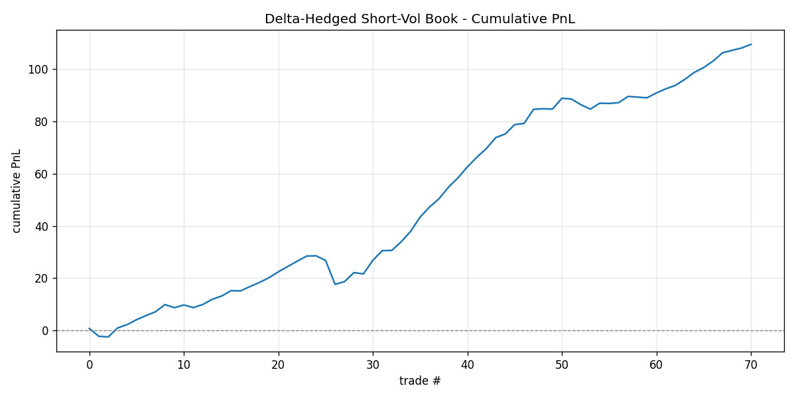
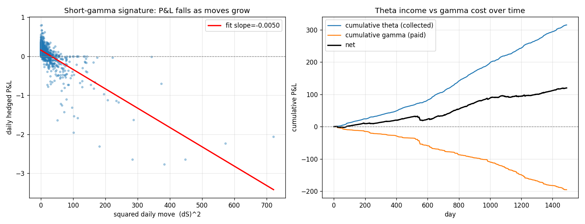

# Options Market Maker

A from-scratch options market-making and dynamic-hedging engine in Python, built
up in six modules from Black–Scholes pricing to a real-data backtest of a
delta-hedged short-volatility book — with full P&L attribution into its
theta and gamma components.

The goal is not a black-box "it makes money" backtest. Every layer is
transparent: the project quantifies *where* the edge comes from (the volatility
risk premium and the market-making spread), *what* it costs (transaction costs
and gamma losses on large moves), and *where* it breaks (short tail risk, visible
as the COVID-2020 drawdown).

---

## Headline results (real SPY / VIX data, 2018–2023)

A delta-hedged short-vol book — sell a rolling 1-month ATM SPY call at the
market's implied vol (VIX), hedge daily along the realised price path:

| Metric | Value |
|---|---|
| Trades | 71 |
| Total P&L | 109.5 |
| Sharpe (annualised) | **2.41** |
| Win rate | 78.9% |
| Max drawdown | 10.9 (COVID, Feb–Mar 2020) |

**P&L decomposition** (Module 5): spread capture 16.2 · vol-risk-premium 93.4 ·
hedging cost −26.6.

**Gamma/theta attribution** (Module 6, 1,491 hedged days): theta collected
**+315.2**, gamma paid **−195.2**, net **+120.0 ≈ the realised vol premium**.
The −½·Γ·(ΔS)² approximation explains daily spot P&L with **corr 0.977**.




The left scatter is the short-gamma signature: small positive P&L on calm days
(theta income), large negative P&L on big moves (gamma cost) — slope is
negative by construction. The right panel shows theta income and gamma cost
accumulating in opposite directions, their gap being the strategy's edge.

---

## Modules

| # | File | What it does |
|---|---|---|
| 1 | `black_scholes.py` | BS pricing, all five Greeks, Monte-Carlo cross-check, MC→BS convergence plot |
| 2 | `implied_vol.py` | Implied-vol solver: Newton–Raphson with a bisection fallback for the low-vega tails |
| 3 | `quote_engine.py` | Risk-scaled two-sided quotes; half-spread widens with vol and vega; tracks spread in $ and bps |
| 4 | `hedging_engine.py` | Monte-Carlo delta-hedging sim; sweeps re-hedge frequency to map hedging-error vs transaction-cost; splits realised vs implied vol to show the vol-arb P&L |
| 5 | `backtest.py` | Real-data backtest of the delta-hedged short-vol book on SPY/VIX; Sharpe, win rate, drawdown, P&L decomposition |
| 6 | `gamma_attribution.py` | Day-by-day attribution of hedged P&L into theta income vs gamma cost; the short-gamma signature plot |

---

## The core ideas, briefly

**Implied vol (M2).** There's no closed form for the vol that reproduces a market
price, so we invert numerically. Newton–Raphson converges in a handful of steps
using vega as the gradient, but vega → 0 for deep ITM/OTM options and Newton
diverges there — so the solver falls back to (slow but bulletproof) bisection.

**Quoting (M3).** A market maker never trades at theoretical value; it quotes a
bid below and an ask above, earning the spread for providing liquidity and
warehousing risk. The half-spread scales with volatility and vega, so the quote
widens exactly where the position is most exposed.

**Hedging (M4).** Selling an option creates delta exposure that's neutralised by
trading the underlying. But delta drifts as spot moves (gamma), forcing
re-hedging. Hedge too often → bleed transaction costs; too rarely → large
hedging error. The engine maps this tradeoff directly.

**The short-vol edge (M5–M6).** A delta-hedged short option earns the gap between
implied and subsequently-realised volatility. Mechanically, the daily P&L is

```
daily P&L (short, hedged)  ≈  θ·dt  −  ½·Γ·(ΔS)²
```

— collect theta every day, pay gamma scaled by the squared move. Module 6
verifies this empirically (corr 0.977) and shows the net is the vol premium.

---

## Honest caveats

These are deliberate scope choices, not oversights:

- **VIX as the implied-vol input.** VIX is a 30-day SPX implied vol; used here as
  a clean proxy for the implied vol on the SPY option sold. A production version
  would use the actual option's quoted IV.
- **No margin / stop-out modelling.** The backtest holds each position to expiry.
  A real short-vol book can be margin-called during a vol spike (e.g. COVID) and
  forced to cover at the worst price — so the realised Sharpe is somewhat
  optimistic and the tail risk is larger than the drawdown shown.
- **Flat vol per trade.** Implied vol is held fixed over each option's life; no
  vol surface / skew dynamics.
- **European options, GBM in the simulator.** The Monte-Carlo modules (M1, M4)
  assume GBM; the backtest (M5–M6) uses the real price path, so realised
  fat-tails and the COVID crash are present in the headline results.

---

## Running it

```bash
pip install numpy scipy pandas matplotlib yfinance

python implied_vol.py        # M2 self-test (round-trip vol recovery)
python quote_engine.py       # M3 quote tables
python hedging_engine.py     # M4 hedging-error vs cost + vol-arb experiments
python backtest.py           # M5 real-data backtest  (needs internet)
python gamma_attribution.py  # M6 theta/gamma attribution + signature plot
```

Modules 5–6 pull SPY and VIX history via `yfinance`. Module 6 falls back to a
synthetic path if offline.
